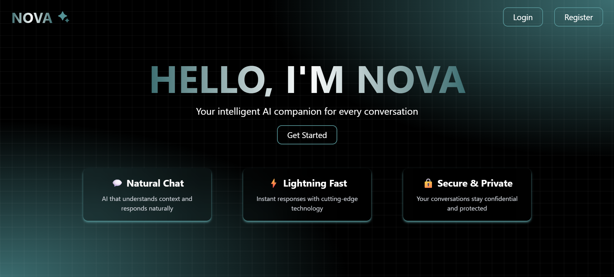

# 🤖 Nova AI - Intelligent Chat Application

A modern, full-stack AI chat application built with React and Node.js, featuring real-time messaging, user authentication, and an intuitive interface for seamless AI conversations.



## 🌟 Features

### 💬 **Chat Experience**
- Real-time AI conversations with instant responses
- Multiple chat sessions with persistent history
- Message formatting with **bold**, *italic*, `code`, and code blocks
- Syntax highlighting for code snippets with copy functionality
- Typing indicators and smooth animations
- Mobile-responsive design

### 🔐 **Authentication & Security**
- Secure user registration and login
- JWT-based authentication with HTTP-only cookies
- Protected routes with automatic redirects
- Password hashing with bcrypt
- Session management and logout functionality

### 🎨 **User Interface**
- Modern, dark-themed design with teal accents
- Animated Lottie robot mascot
- Responsive sidebar with chat history
- Custom animated buttons and transitions
- Toast notifications for user feedback
- Mobile-first responsive design

### ⚡ **Performance & Technology**
- Real-time WebSocket communication
- Optimized React components with custom hooks
- Efficient state management
- Fast Vite build system
- Production-ready deployment

## 🛠️ Tech Stack

### Frontend
- **React 18** - Modern UI library with hooks
- **Vite** - Lightning-fast build tool
- **React Router** - Client-side routing
- **Socket.IO Client** - Real-time communication
- **Tailwind CSS** - Utility-first CSS framework
- **Lottie React** - Smooth animations
- **Axios** - HTTP client with interceptors

### Backend
- **Node.js** - JavaScript runtime
- **Express.js** - Web application framework
- **Socket.IO** - Real-time WebSocket communication
- **MongoDB** - NoSQL database
- **Mongoose** - MongoDB object modeling
- **JWT** - JSON Web Tokens for authentication
- **bcrypt** - Password hashing

### DevOps & Deployment
- **Render** - Cloud platform for deployment
- **Git** - Version control
- **Environment Variables** - Configuration management

## 🚀 Quick Start

### Prerequisites
- Node.js (v16 or higher)
- MongoDB (local or cloud instance)
- Git

### Installation

1. **Clone the repository**
   ```bash
   git clone https://github.com/yourusername/nova-ai.git
   cd nova-ai
   ```

2. **Install Backend Dependencies**
   ```bash
   cd Backend
   npm install
   ```

3. **Install Frontend Dependencies**
   ```bash
   cd ../Frontend
   npm install
   ```

4. **Environment Setup**
   
   Create `.env` file in the Backend directory:
   ```env
   MONGODB_URI=your_mongodb_connection_string
   JWT_SECRET=your_jwt_secret_key
   PORT=3000
   ```

5. **Start the Application**
   
   **Backend (Terminal 1):**
   ```bash
   cd Backend
   npm start
   ```
   
   **Frontend (Terminal 2):**
   ```bash
   cd Frontend
   npm run dev
   ```

6. **Access the Application**
   - Frontend: `http://localhost:5173`
   - Backend API: `http://localhost:3000`

## 📁 Project Structure

```
nova-ai/
├── Backend/
│   ├── src/
│   │   ├── controllers/     # Request handlers
│   │   ├── models/          # Database schemas
│   │   ├── routes/          # API routes
│   │   ├── middlewares/     # Custom middleware
│   │   ├── services/        # Business logic
│   │   ├── sockets/         # WebSocket handlers
│   │   └── db/              # Database connection
│   ├── server.js            # Entry point
│   └── package.json
├── Frontend/
│   ├── src/
│   │   ├── components/      # Reusable components
│   │   ├── pages/           # Page components
│   │   ├── hooks/           # Custom React hooks
│   │   ├── utils/           # Utility functions
│   │   ├── config/          # Configuration files
│   │   └── assets/          # Static assets
│   ├── public/              # Public assets
│   ├── index.html
│   └── package.json
└── README.md
```

## 🎯 Key Components

### Frontend Architecture
- **Custom Hooks**: `useSocket`, `useChat`, `useMessageHandler`
- **Protected Routes**: Authentication-based route protection
- **Real-time Communication**: Socket.IO integration
- **Responsive Design**: Mobile-first approach with Tailwind CSS

### Backend Architecture
- **RESTful API**: Clean API design with Express.js
- **WebSocket Server**: Real-time messaging with Socket.IO
- **Authentication Middleware**: JWT-based route protection
- **Database Models**: Mongoose schemas for users, chats, and messages

## 🔧 API Endpoints

### Authentication
- `POST /api/auth/register` - User registration
- `POST /api/auth/login` - User login
- `GET /api/auth` - Get auth endpoints info

### Chat Management
- `GET /api/chat` - Get user's chat history
- `POST /api/chat` - Create new chat
- `GET /api/chat/:chatId/messages` - Get chat messages

### WebSocket Events
- `ai-message` - Send message to AI
- `ai-response` - Receive AI response
- Connection/disconnection handling

## 🎨 Design System

### Color Palette
- **Primary**: `#3c6e71` (Dark Teal)
- **Secondary**: `#549295` (Light Teal)
- **Accent**: `green-400` (Success/Code highlighting)
- **Background**: Dark theme with transparency effects

### Typography
- **Headings**: Bold, gradient text effects
- **Body**: Clean, readable fonts
- **Code**: Monospace with syntax highlighting

## 📱 Mobile Responsiveness

- Collapsible sidebar for mobile devices
- Touch-friendly interface elements
- Optimized input areas and buttons
- Responsive typography and spacing
- Smooth animations and transitions

## 🔒 Security Features

- Password hashing with bcrypt
- JWT token authentication
- HTTP-only cookies for enhanced security
- CORS configuration for cross-origin requests
- Input validation and sanitization
- Protected API routes

## 🚀 Deployment

### Production Build
```bash
# Frontend
cd Frontend
npm run build

# Backend
cd Backend
npm start
```

### Environment Variables (Production)
```env
MONGODB_URI=your_production_mongodb_uri
JWT_SECRET=your_production_jwt_secret
NODE_ENV=production
PORT=3000
```

## 🤝 Contributing

1. Fork the repository
2. Create a feature branch (`git checkout -b feature/amazing-feature`)
3. Commit your changes (`git commit -m 'Add amazing feature'`)
4. Push to the branch (`git push origin feature/amazing-feature`)
5. Open a Pull Request

## 📝 License

This project is licensed under the MIT License - see the [LICENSE](LICENSE) file for details.

## 🙏 Acknowledgments

- **Gemini** for AI integration inspiration
- **Lottie Files** for beautiful animations
- **Tailwind CSS** for the utility-first CSS framework
- **Socket.IO** for real-time communication
- **MongoDB** for flexible data storage

<!-- ## 📞 Contact

**Your Name** - [your.email@example.com](mailto:your.email@example.com)

**Project Link**: [https://github.com/yourusername/nova-ai](https://github.com/yourusername/nova-ai)

**Live Demo**: [https://nova-ai-demo.onrender.com](https://nova-ai-demo.onrender.com)

--- -->

⭐ **Star this repository if you found it helpful!**

Built with ❤️ by Gurpreet Kaur